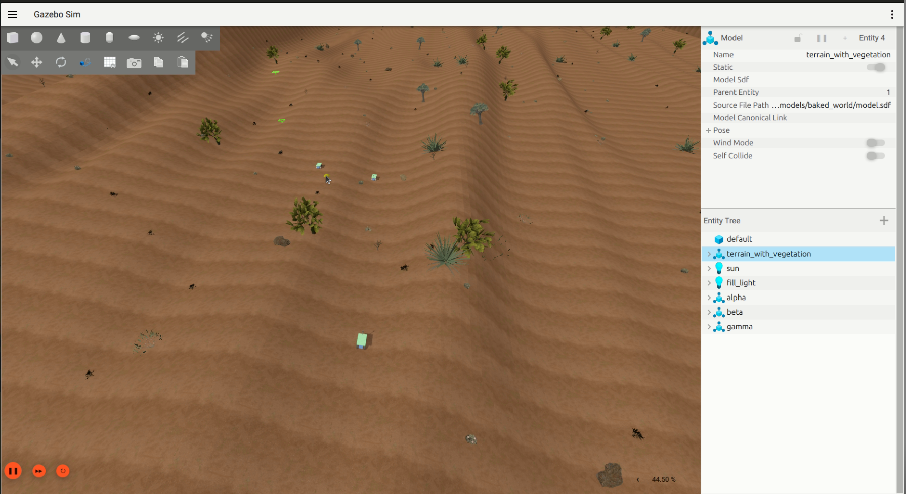
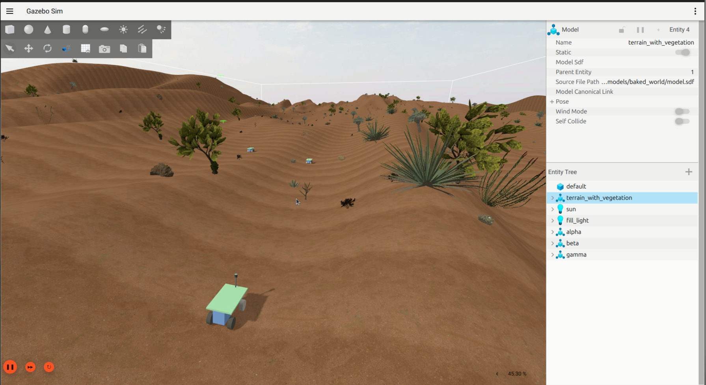
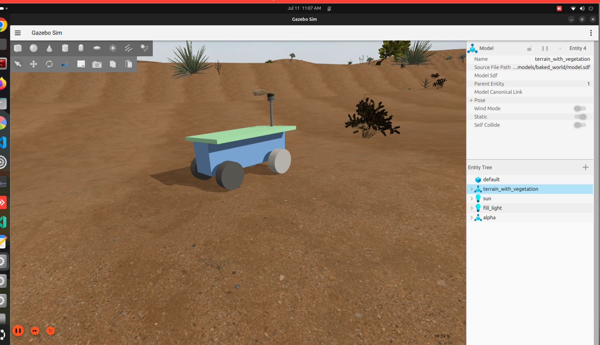

<div align="center">

# Silent Sentry

### Autonomous GPS-Denied Patrol UGV · EMCON-Aware · Terrain-Referenced Navigation

*ROS 2 Jazzy · Gazebo Harmonic · Bullet-Featherstone Physics · iSAM2 · MCL*

[](https://docs.ros.org/en/jazzy/)
[](https://gazebosim.org/)
[](LICENSE)

</div>

---

## The Mission

Desert surveillance in GPS-denied, RF-contested environments. Silent Sentry is an autonomous UGV that:

- **Finds itself** without GPS, using terrain shape matching against a pre-loaded DEM
- **Plans safely** avoiding steep dunes with an a-priori terrain costmap + live LiDAR detection
- **Patrols unpredictably** with a Lévy-flight brain so the pattern cannot be anticipated
- **Stays silent** with near-zero EM signature, micro-burst comms only when essential

---

## Simulation World - Namib Desert

<table>
<tr>
<td width="33%"></td>
<td width="33%"></td>
<td width="33%"></td>
</tr>
<tr>
<td align="center"><em>Top-down fleet view</em></td>
<td align="center"><em>Cinematic perspective</em></td>
<td align="center"><em>UGV close-up</em></td>
</tr>
</table>

The world is a 900 × 300 m photorealistic Thar Desert corridor (WGS-84 anchored at −24.19°N / 15.64°E) with a DEM elevation range of 0-44.8 m and dense desert vegetation. Physics: **Bullet-Featherstone** reduced-coordinate dynamics.

---

## System Architecture

```
╔══════════════════════════════════════════════════════════════════════════╗
║                         SILENT SENTRY STACK                             ║
╠══════════════╦═══════════════════════╦═══════════════════════════════════╣
║  PERCEPTION  ║    LOCALIZATION       ║        PLANNING & CONTROL         ║
║              ║                       ║                                   ║
║  /scan/      ║  IMU → Madgwick       ║  SBLP Goal Generator              ║
║  points      ║  (AHRS)               ║  (Lévy patrol, geo-fenced)        ║
║  (LiDAR 3D)  ║       │               ║         │ NavigateToPose          ║
║      │       ║  Wheels + IMU →       ║         ▼                         ║
║      ├───────╬──► Terramechanic      ║      Nav2 Stack                   ║
║      │       ║    Odometry           ║    ┌──────────────┐               ║
║      │       ║    (Bekker-Wong)      ║    │ Smac Hybrid  │ global plan   ║
║      │       ║       │               ║    │ A* (Reeds-   │               ║
║      │       ║  GTSAM iSAM2          ║    │ Shepp)       │               ║
║      │       ║  Factor Graph         ║    └──────┬───────┘               ║
║      │       ║  (50 Hz dead-reckon)  ║           │                       ║
║      │       ║       │               ║    ┌──────▼───────┐               ║
║      │       ║  MCL DEM Matcher      ║    │ RPP          │ local control ║
║      │       ║  (NCC, 3 Hz)  ────── ╬───►│ Controller   │               ║
║      │       ║       │  map→odom     ║    └──────┬───────┘               ║
║      ▼       ║       │               ║           │ /cmd_vel              ║
║  DEM-Prior   ║  map ─► odom ─►       ║           ▼                       ║
║  Obstacle    ║        base_footprint ║  Ackermann Twist Controller       ║
║  Detector    ║  (REP-105 frames)     ║  (bicycle kinematics, 50 Hz)      ║
║  (C++ /      ╠═══════════════════════╣           │                       ║
║  grid_map)   ║    EMCON COMMS        ║  Gazebo   │                       ║
║      │       ║                       ║  Joint    │                       ║
║      ▼       ║  Directional micro-   ║  States ──┘                       ║
║ /scan/       ║  burst topology,      ║                                   ║
║ obstacles    ║  near-zero EM sig.    ║  RL Geo-Fence (PPO, elastic       ║
║ (costmap     ║  (Zenoh transport,    ║  zone reallocation for fleet)     ║
║  input)      ║  PHY enforcement)     ║                                   ║
╚══════════════╩═══════════════════════╩═══════════════════════════════════╝
```

### Frame chain (REP-105)

```
map ──(TRN MCL, 3 Hz)──► odom ──(iSAM2 factor graph, 50 Hz)──► base_footprint
         global fix                   local dead-reckoning
```

TRN holds global authority (`map→odom`). The factor graph owns local authority (`odom→base_footprint`). No AMCL. No GPS.

---

## The Four Novelties

### 1 - Terrain-Referenced Navigation (TRN)

```
LiDAR point cloud
      │
      ▼
 local_dem_builder ──► rolling local DEM (C++ lifecycle node)
      │
      ▼
 MCL particle filter ──► NCC match against global a-priori DEM
      │         800 particles, ESS-gated resample
      ▼
 correction (PoseWithCovarianceStamped)
      │
      ▼
 GTSAM iSAM2 factor graph ──► fused pose + odom→base TF @50 Hz
```

No GPS. No fiducials. Pure terrain shape. Works in dunes where GPS is jammed and visual landmarks are absent.

Key parameters: `base_search_radius 5 m`, `min_peak_quality 0.65`, `entropy_threshold 0.8` (abort match on featureless sand), `motion_noise_xy_frac 0.15`.

### 2 - EMCON-Aware Micro-Burst Comms

Continuous RF = a targeting signal. Silent Sentry uses a **connectionless, directional micro-burst topology**. The EMCON state machine gates all transmission; the base station sends elastic geo-fence updates only when the robot is in a shadow. Physical-layer silence is enforced by hardware, not protocol.

### 3 - Spatially-Bounded Lévy Patrol (SBLP)

```
current pose (x, y, θ)
       │
       ▼
 Lévy step draw: l ~ Pareto(β=1.8), l ∈ [6, 35] m
 Heading draw:   Δθ ~ WrappedNormal(σ=1.4 rad)
       │
       ▼
 terrain gate ──► reject if slope > ~27° (on the a-priori DEM)
 geo-fence gate ──► reject if outside the sector polygon
       │
       ▼
 NavigateToPose ──► Nav2 handles obstacle avoidance and path
```

Heavy-tailed step distribution guarantees both fine-grained local search (short hops) and rare long-range jumps. Unpredictable pattern cannot be anticipated by an adversary.

### 4 - RL Elastic Geo-Fencing

A PPO agent at the base station monitors breach events from the fleet and dynamically reshapes each robot's patrol sector. Multi-robot coverage is maintained even when one UGV is blocked or disabled.

---

## Package Map

```
silent_sentry/
├── src/
│   ├── 1_base_station_env/
│   │   └── base_station_bringup/     world SDF, launch files, terrain maps
│   └── 2_ugv_fleet_brain/
│       ├── ugv_localization/         TRN pipeline + odom visualizer
│       ├── ugv_estimation/           GTSAM iSAM2 factor graph (C++)
│       ├── ugv_trn/                  MCL DEM matcher (C++)
│       ├── ugv_local_dem/            Rolling DEM builder (C++)
│       ├── ugv_terramechanics/       Bekker-Wong wheel odometry
│       ├── ugv_ackermann_controller/ Bicycle-kinematic Twist→steering
│       ├── ugv_obstacle/             DEM-prior obstacle detector (C++ / grid_map)
│       ├── bot_navigation/           Nav2 launch + config + terrain costmap
│       ├── bot_controller/           ros2_control bringup
│       ├── bot_description/          URDF / meshes (1.4 × 0.8 m Ackermann UGV)
│       ├── sblp_planner/             Lévy patrol goal generator
│       ├── rl_geofencing/            PPO elastic geo-fence agent
│       ├── emcon_controller/         EMCON state machine
│       ├── emcon_hardware_interface/ ros2_control hardware interface
│       ├── fleet_bringup/            Multi-robot launch
│       └── silent_sentry_interfaces/ Custom ROS 2 messages
├── docs/
│   ├── PIPELINE_BRINGUP.md          Layer-by-layer bring-up + isolation guide
│   └── TUNING.md                    Full parameter reference + hard constraints
├── paper_data/                      LaTeX + figures for IEEE submission
└── media/                           Images used in this README
```

---

## Quick Start

### Prerequisites

| Dependency | Version | Install |
|---|---|---|
| ROS 2 | Jazzy | [docs.ros.org](https://docs.ros.org/en/jazzy/Installation.html) |
| Gazebo Harmonic | ≥ 8.11 | `sudo apt install ros-jazzy-ros-gz*` |
| grid_map | Jazzy | `sudo apt install ros-jazzy-grid-map-*` |
| GTSAM | 4.2+ | `sudo apt install ros-jazzy-gtsam` |
| Python | 3.12 | system |

### Build

```bash
git clone https://github.com/yenode/silent_sentry.git
cd silent_sentry

# If the machine has a non-system Python 3.9 polluting PYTHONPATH (common):
mkdir -p ~/.colcon
cat > ~/.colcon/defaults.yaml <<'EOF'
build:
  cmake-args:
    - -DPython3_EXECUTABLE=/usr/bin/python3.12
    - -DPython3_ROOT_DIR=/usr
EOF

source /opt/ros/jazzy/setup.bash
colcon build --symlink-install
source install/setup.bash
```

### Launch (5 terminals, each sourced)

```bash
# T1 — world
ros2 launch base_station_bringup world_only.launch.xml

# T2 — robot
ros2 launch fleet_bringup robot_only.launch.xml bot_name:=alpha

# T3 — TRN localization
ros2 launch ugv_localization terramechanic_localization.launch.py

# T4 — Nav2 (TRN owns map→odom; no AMCL)
ros2 launch bot_navigation nav2_trn.launch.py

# T5 — Lévy patrol
ros2 launch sblp_planner sblp_nav2.launch.py use_sim_time:=true
```

> ⚠️ **Launch order matters.** TRN (T3) MUST be running and publishing `map→odom`
> before Nav2 (T4) starts, or Nav2's costmaps cannot transform.

---

## Key Configuration Files

| File | Purpose | Key values to know |
|---|---|---|
| `bot_navigation/config/nav2_params.yaml` | Full Nav2 config | See inline comments |
| `ugv_localization/config/trn_slam.yaml` | MCL params | `base_search_radius 5.0` — **do not raise** (see TUNING.md) |
| `ugv_localization/config/terramechanic_odometry.yaml` | Wheel odom | Bekker-Wong soil params |
| `ugv_obstacle/config/obstacle.yaml` | Obstacle detector | `self_radius 1.0`, `tau_prior 0.3` |
| `bot_navigation/maps/terrain_costmap.yaml` | A-priori slope map | `mode: scale`, `occupied_thresh: 0.99` |
| `docs/TUNING.md` | All params | Hard constraints table (§11) |

---

## Hard Constraints (do not break these)

```
1. Global inflation_radius ≥ 0.82 m (circumscribed radius of 1.4×0.8 m footprint)
   Breaking it disables the Smac potential field → no valid path found on every goal.

2. SBLP l_max ≤ 0.6 × global costmap half-window
   l_max 35 m, half-window 70 m → ratio 0.5 ✓
   Breaking it puts goals outside the reachable window.

3. minimum_turning_radius == wheelbase / tan(max_steering_angle) == 3.36 m
   Planner and ackermann controller must agree.

4. use_rotate_to_heading: false
   Ackermann cannot rotate in place; RPP rotate emits linear=0 → robot freezes.

5. raytrace_min_range ≥ self_radius (1.0 m)
   Without this, clearing rays erase obstacles the robot is approaching.
```

Full parameter catalogue and derivations: [`docs/TUNING.md`](docs/TUNING.md)  
Isolation bringup guide: [`docs/PIPELINE_BRINGUP.md`](docs/PIPELINE_BRINGUP.md)

---

## Diagnostic Quick Reference

| Log message | Cause | Layer |
|---|---|---|
| `Start occupied` | Robot's own cell is lethal in the global costmap | L4 (docs/PIPELINE_BRINGUP.md) |
| `no valid path found` | Goal unreachable / inflation too wide / goal outside window | L5 |
| `detected collision ahead` (loop) | Costmap over-marking or 1.0s collision horizon too eager | L3/L6 |
| `Transform data too old` | TF starvation (unthrottled std::cerr in fuser — gate with SILENT_SENTRY_FUSER_DIAG) | L0 |
| `The inflation radius ... is smaller than circumscribed` | global inflation_radius < 0.82 — NEVER lower below 0.9 | Hard constraint 1 |
| ATE runaway despite quality > 0.9 | Terrain aliasing — high NCC on flat dunes; tune entropy_threshold | L1 |

---

## TRN Performance

On the current baseline (Thar Desert world, bullet-featherstone physics):

| Metric | Value |
|---|---|
| TRN correction rate | ~3 Hz |
| dead-reckoning fusion rate | 50 Hz |
| Typical ATE (open terrain) | ~2–4 m |
| MAD match quality (moving) | 0.75–0.95 |
| ATE behaviour on aliased dunes | bounded (not runaway) |

> ATE is the key metric. High likelihood with rising ATE = confident wrong lock
> on self-similar dune terrain. See TUNING.md §5 for the diagnostic-gated levers.

---

## Citation

```bibtex
@inproceedings{silent_sentry_2026,
  title  = {Silent Sentry: GPS-Denied Autonomous Patrol in Contested Desert Terrain},
  author = {Aditya Pachauri and {IIIT-Allahabad}},
  year   = {2026}
}
```

---

<div align="center">
<sub>Built at IIIT-Allahabad · ROS 2 Jazzy · Gazebo Harmonic · Apache 2.0</sub>
</div>
